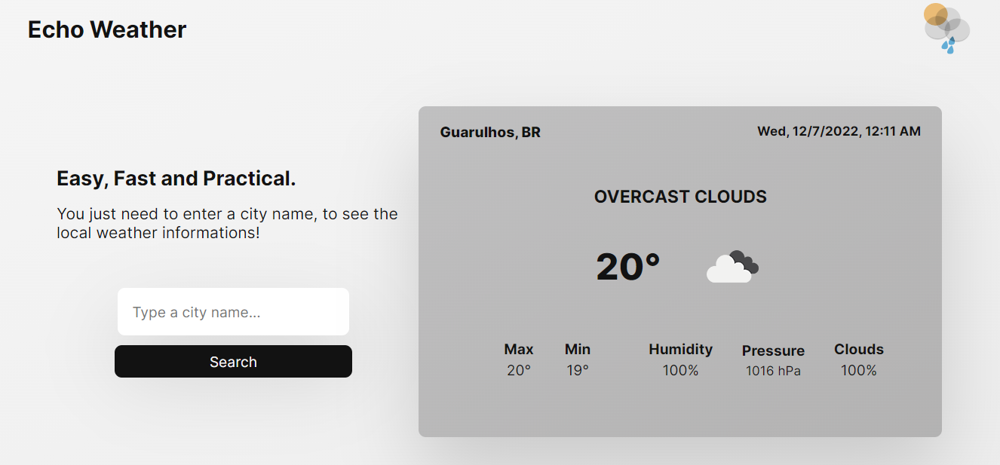

# Echo Weather

> Easy, Fast and Practical Weather App.
> Live demo [_here_](https://github.com/GFTF0906/echo-weather).

## Table of Contents

- [Echo Weather](#echo-weather)
  - [Table of Contents](#table-of-contents)
  - [General Information](#general-information)
  - [Technologies Used](#technologies-used)
  - [Features](#features)
  - [Screenshots](#screenshots)
  - [Usage](#usage)
  - [Project Status](#project-status)
  - [Room for Improvement](#room-for-improvement)
  - [Contact](#contact)

## General Information

Echo Weather is a project whose main objective is the practicality of offering meteorological information for any city that the user wants.

## Technologies Used

- JavaScript (fetch method)
- HTML5 (Semantic tags)
- CSS3 (Flexbox, Grid, Responsive Design)
- APIs (openweather, geoapify)

## Features

- View real temperature, date and hour of any city you want
- Maximum, minimum temperature and weather description
- Percentage of clouds, pressure and humidity of the desired location
- Changes background colors depending on the time of day
- Possibility to view the layout on any device

## Screenshots

## Usage

To use it, it is only necessary to write a city and click on search, or just enter the project page, because, by default, the user's local weather information is shown.

## Project Status

Project is: _in progress_

## Room for Improvement

Room for improvement:

- Feel free, to give me a feedback :)

To do:

- Add weather information for other days of the week

## Contact

Created by [Guilherme Fontebasso Tavares Faria](https://github.com/GFTF0906)

- My [Twitter](https://twitter.com/echolovesjava)
- My [Instagram](https://www.instagram.com/guifontebassoft/?hl=pt-br)
